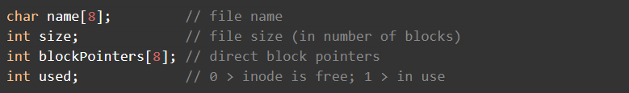
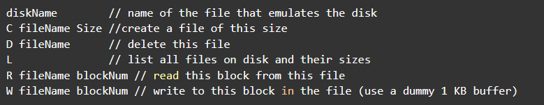
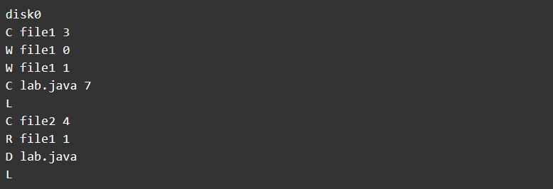

# File System

## Overview

The goal of this lab is to write a simple UNIX-like file system based on the topics covered in class. Although you will implement a toy file system, you will learn about many concepts used in real file systems. The file system you will write makes the following simplifying assumptions:

- The file system resides on a disk that is 128 KB in size.
- There is only one root directory. No subdirectories are allowed.
- The file system supports a maximum of 16 files.
- The maximum size of a file is 8 blocks; each block is 1 KB in size.
- Each file has a unique name, the file name can be no longer than 8 characters.

The layout of your 128 KB disk is as follows:

- The first 1KB block is called the super block. It stores the free block list and index nodes(inode) for each file.
- The remaining 127 1KB blocks store data blocks of the files on your file system.
- The exact structure of the super block is as follows.
  - The first 128 bytes stores the free block list. Each entry in this list indicates whether the corresponding block is free or in use (if the i-th byte is 0, it indicates that the block is free, else it is in use). Initially all blocks except the super block are free.
  - Immediately following the free block list are the 16 index nodes, one for each file that is allowed in the file system.

Initially, all inodes are free. Each inode stores the following information:



Note that each inode is 48 bytes in size, since a char has size 1 and an int has size 4. Together, all 16 inodes take up 768 bytes. Combining this with the free block list gives us a total size of 896 bytes for the super block. The super block may not fill the 1 KB, but start writing file blocks after 1 KB into the disk.

You need to implement the following operations for your file system:

```c++
int​​ myFileSystem::create_file​(​char​ name[​8​], ​int​ size)
```
- Create a new file with this name and with these many blocks. (For simplicity, we shall assume that the file size is specified at file creation time and the file does not grow or shrink from this point on). This method returns 1 on success and -1 on failure.
<br></br>

```c++
int​​ myFileSystem::delete_file​(​char​ name[​8​])
```
- Delete the file with the given ​name​. This method returns 1 on success and -1 on failure.
<br></br>

```c++
int ​​myFileSystem::read​(​char​ name[​8​], ​int​ blockNum, ​char​ buf[​1024​])
```
- Read the specified block from this file into the specified buffer; ​blockNum​ can range from 0 to 7. This method returns 1 on success and -1 on failure.
<br></br>

```c++
int ​​myFileSystem::write​(​char​ name[​8​], ​int​ blockNum, ​char​ buf[​1024​]
```
- Write the data in the buffer to the specified block in the file. This method returns 1 on success and -1 on failure.
<br></br>

```c++
int ​​myFileSystem::ls​()
```
- List the names of all files in the file system and their sizes. This method returns 1 on success and 0 on failure.
<br></br>

```c++
int​​myFileSystem::close_disk​()
```
- Close the disk. This method returns 1 on success and 0 on failure.
<br></br>

## Getting Started

First, .

We will use a 128KB file to act as the "disk" for your file system. We have provided a program to create this file for you and format it. Run this program by typing the command:


This will create a file with the name ​*disk0*​ in your current directory. The program also "formats" your file system - this is done by initializing all blocks in the super block to be free and marking all 16 inodes to be free.

The file *​create_fs.c​* in the starter code allows you to create an empty file system.

The starter code also includes a file ​*fs.cpp​* that includes the template code for your file system. We have provided copious comments for each method so that you know how to implement each function.

Remember that your file system must be **​persistent**​. If you shutdown your program and then restart it at a later time, all files on your file system must be intact.

## Input File

Your program should take input from an input file and perform actions specified in the file, while printing out the result of each action. The format of the input file is as follows.



A sample input file looks like this:



A sample input file is also provided in the starter code.

Be sure to print out what your program does after reading each line from this file.  It is also helpful if you print out the disk addresses of any block that you allocate, deallocate, read or write.

The test directory contains some simple tests for your filesystem implementation.  You should write your own tests for each function you implement: read, write, create, ls, delete.

The tests can use the Google Test Framework but they don't need to. You can use specific input files to test your code (for example, trying to create an existing file should give you an error, or trying to delete a non-existent file should be an error, or listing files after deleting a file should no longer list the file etc).